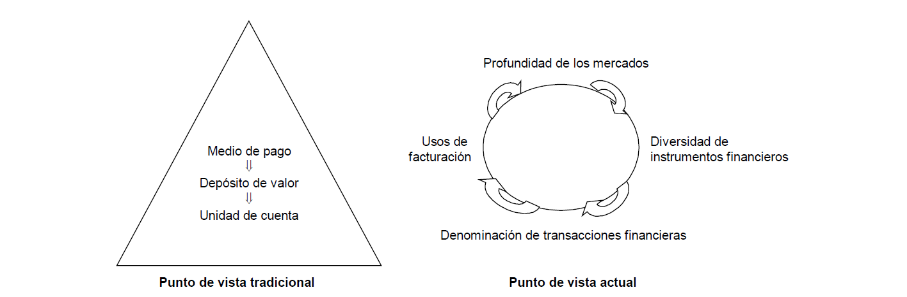

# Tema 4: SME, Política Monetaria Única y Política Cambiaria

## 1. El Sistema Monetario Europeo

El tratado de Roma prestó poca atención a los aspectos monetarios.

En 1969 se reconoció como objetivo de la CEE el establecimiento de una ==Unión Económica **y Monetaria**==.

!!! faq "¿Qué es una Unión Monetaria?"
    Condiciones:

    - Convertibilidad total e irreversible de las monedas entre sí y la total libertad de movimientos de capital
    - Total integración de los sistemas bancarios y de los demás mercados financieros
    - Fijación irrevocable de los tipos de cambio entre las monedas

!!! faq "¿Qué es una Unión Económica?"
    Condiciones:

    - Libre circulación de personas, mercancías, servicios y capitales
    - Régimen de libre competencia
    - Políticas comunes de cambio estructural y desarrollo regional
    - Coordinación de las políticas macroeconómicas

!!! error "El Acuerdo de la Serpiente"
    En 1972 se firmó el `Acuerdo de la Serpiente`, que obligaba a las divisas comunitarias a mantener entre ellas un margen bilateral de fluctuación del $\pm 2.25\%$ y en relación con el dólar el $\pm 2.25\%$. El acuerdo fue un rotundo fracaso.

En 1979 nació el ==**Sistema Monetario Europeo (SME)**==. Sus objetivos son:

- **Estabilidad externa** en los tipos de cambio de las monedas europeas
- **Estabilidad interna**
- **Avanzar hacia el uso privado del ECU[^1]**

*[ECU]: European Currency Unit
[^1]: unidad de cuenta en el SME, definida como una cesta de monedas de los países miembros.

El SME ha pasado por varias crisis. Su raíz está en la incompatibilidad de objetivos que ha arrastrado desde su creación.

En 1999 fue sustituido por el ==**Nuevo Mecanismo de Tipos de Cambio del SME o MTC II**== (conocido popularmente como SME-2). El `MTC II` es un acuerdo multilateral de tipos de cambio fijos pero ajustables. Establece una paridad entre las monedas participantes y el euro, con una banda de fluctuación estándar del $\pm 15\%$ en torno a la paridad central.

El objetivo del `MTC II` es mantener la estabilidad de los tipos de cambio entre el euro y las monedas nacionales y evitar así las excesivas fluctuaciones de los tipos de cambio en el mercado interior.

!!! faq "¿Se puede unir cualquier Estado no miembro de la UE?"
    Sí.

## 2. La Política Monetaria Única

{==

La base jurídica de la [Política Monetaria Única](#2-la-política-monetaria-única) es el `Tratado Consecutivo de la Comunidad Europea.` En él se crearon el **Banco Central Europeo (BCE)** y el **Sistema Europeo de Bancos Centrales (SEBC)**.

- El **BCE asumió las funciones del Instituto Monetario Europeo** (IME), que fue liquidado
- El **SEBC está formado por el BCE y los bancos centrales de todos los Estados miembros**.
    - ^^Define y ejecuta la política monetaria única en los países que han adoptado el euro^^.
    - El **eurosistema** está formado por el **BCE y los bancos centrales de los Estados miembros que han adoptado el euro**.

==}

!!! check "Propósitos estratégicos del Eurosistema y del MUR"
    - Autoridad reconocida en asuntos monetarios y financieros
    - Estabilidad financiera e integración financiera europea
    - Obligación de rendir cuentas, cerdibilidad y confianza
    - Identidad común, claridad de funciones y de responsabilidades y buena gestión
    - Buenas prácticas de supervisión bancaria, igualdad de trato y de condiciones
    - Enfoque de supervisión basado en el riesgo y proporcionalidad

??? abstract "Principios organizativos del Eurosistema y del MUS"
    - Participación
    - Cooperación
    - Transparencia y rendición de cuentas
    - Diferenciación entre las actividades europeas y nacionales
    - Cohesión y unidad
    - Intercambio de recursos
    - Eficacia y eficiencia en la adopción de decisiones
    - Eficiencia en términos de costes, medición y metodología
    - Aprovechar sinergias y evitar duplicidades

!!! danger ""
    **El SEBC no tiene personalidad jurídica.** Actúa a través del BCE y de los Bancos Nacionales. Los órganos rectores del SEBC son los del BCE.

### 2.1. Independencia, transparencia y rendición de cuentas

#### 2.1.1. Independencia

Ni el BCE ni los bancos centrales podrá solicitar ni aceptar instrucciones de instituciones de la UE, gobiernos de los Estados miembros ni de ningún otro órgano.

==La razón que justifica la independencia de los bancos centrales es que **la competencia de crear dinero debe estar separada de la competencia para gastarlo.**==

!!! info "Concepto de independencia"
    El concepto de independencia incluye los 4 tipos siguientes:

    1. Independencia funcional
    2. Independencia institucional
    3. Independencia personal
    4. Independencia financiera

#### 2.1.2. Transparencia

El BCE facilita al público y a los mercados toda la información relevante sobre su estrategia, evaluación y decisiones de política monetaria. También explica qué interpretación hace de su mandato y expone con claridad sus objetivos de política monetaria.

#### 2.2.3. Rendición de cuentas

El BCE publica un `Boletín Mensual` en lugar de trimestralmente y los miembros del Consejo de Gobierno pronuncian numerosos discursos en los que abordan temas de interés para el público.

### 2.2. La Estrategia de Política Monetaria del BCE

==**El objetivo primordial de la Política Monetaria del BCE es mantener la estabilidad de precios.**==

{==

En 2021 se aprobó la nueva estrategia de política monetaria:

- **Objetivo de inflación simétrico al 2% en medio plazo**
- Se sigue utilizando el IAPC como indicador de precios
- El principal instrumento de política monetaria sigue siendo el conjunto de los tipos de interés del BCE. Tipos de interés oficiales:
    1. Tipo de interés de las operaciones principales de financiación (actualmente: $0\%$, 2016)
    2. Tipo de interés de la facilidad marginal de crédito (actualmente: $0.25\%$, 2016)
    3. Tipo de interés de la facilidad marginal de depósito (actualmente: $-0.50\%$, 2019)

==}

*[IAPC]: Índice Armonizado de Precios al Consumo

!!! pied-piper "Estrategia de Política Monetaria"
    1. Persigue influir en las **condiciones del mercado monetario** y por lo tanto en el **nivel de los tipos de interés a corto plazo**. Desde 2019 se utiliza como variable operativa el €STR (*Euro Short Term Rate*).
    2. Abarca 2 aspectos:
        - [x] El proceso de decisión interna dentro del Banco Central
        - [x] La presentación de las acciones de política monetaria al público
    3. Tiene en cuenta un conjunto de **principios normativos** que orientan sus acciones (*eficacia, rendición de cuentas, transparencia, etc.*) y el **entorno económico y financiero** dentro del que opera (*dimensión de la eurozona, la incertidumbre sobre el proceso de transmisión de la política monetaria, etc.*)
    4. El principal elemento de la estrategia es la definición de estabilidad de precios
    5. Se asienta sobre dos pilares:
        - El **dinero**: se mide mediante el ==agregado monetario amplio M3==. **No constituye un objetivo monetario, únicamente está concebido para orientar al Consejo de Gobierno del BCE.**
        - El análisis periódico de un **amplio conjunto de indicadores económico-financieros de oferta/demanda de bienes, servicios, mercados de factores, etc.** {++ Su objetivo es identificar riesgos para la estabilidad de precios a corto y medio plazo ++}. ^^Subraya la necesidad de disponer de estadísticas de buena calidad.^^

??? tip "El Agregado Monetario M3 amplio"
    Está formado por:

    - [x] Efectivo a manos del público
    - [x] Depósitos a la vista en las **Instituciones Financieras Monetarias (IFMS)** de instituciones no financieras (Familias, empresas no financieras, etc.)
    - [x] Depósitos disponibles con preaviso hasta 3 meses y depósitos a plazo hasta 2 años
    - [x] Cesiones temporales
    - [x] Participaciones en fondos del mercado monetario
    - [x] Valores distintos de acciones hasta 2 años emitidos por las IFMS

### 2.3. Instrumentos y Procedimientos de Política Monetaria

Objetivos de los instrumentos y procedimientos de política monetaria:

- Influir en los tipos de interés del mercado
- Regular la situación de liquidez del sistema bancario
- Señalar la orientación general de política monetaria

#### 2.3.1. Las operaciones de mercado abierto

!!! danger ""
    **Es el grupo más importante**

- **Operaciones principales de financiación:** son las operaciones de mercado abierto más importantes. Constituyen la fuente principal de financiación del sector bancario. {>>Las realizan los BCNs de forma descentralizada<<}
- **Operaciones de financiación a más largo plazo:** tienen periodicidad mensual y con vencimiento a 3 meses. Su objetivo es proporcionar financiación a más largo plazo que el sistema bancario. {>>Se realizan de forma descentralizada mediante subastas estándar<<}
- **Operaciones de ajuste:** No tienen periodicidad ni vencimiento. Su objetivo es regular la situación de liquidez y controlar los tipos de interés del mercado monetario.
- **Operaciones estructurales:** su objetivo es ajustar el volumen de liquidez del Eurosistema frente al sistema bancario. Es decir, controlan el volumen de liquidez disponible en el mercado en un plazo más largo.

Para realizar las operaciones de mercado abierto, el Eurosistema dispone de 5 tipos de instrumentos:

- **Operaciones temporales:** efectúan operaciones de mercado abierto por las que el BCN compra o vende activos por medio de un acuerdo de compra, o efectúa operaciones de crédito en forma de préstamos garantizados.
- **Operaciones simples:** suponen la plena transferencia de la propiedad del vendedor al comprador sin que exista ninguna transferencia asociada de la propiedad en sentido estricto.
- **Swaps de divisas:** operaciones simultáneas al contado y a plazo de euros contra divisas. Se utilizan con fines de ajuste para gestionar la liquidez del mercado y los tipos de interés.
- **Captación de depósitos a plazo fijo:** las entidades colocan depósitos a plazo en sus BCN de origen.
- **Emisión de certificados de deuda del BCE:** constituyen una obligación del BCE frente a su tenedor.

#### 2.3.2. Facilidades permanentes

Existen 2 tipos de facilidades permanentes:

- [x] Facilidad marginal de crédito
- [x] Facilidad de depósito

A través de la facilidad marginal de crédito las entidades pueden obtener préstamos a un día a un tipo de interés predeterminado más alto que el tipo de mercado.

La facilidad de depósito permite a las entidades realizar depósitos a un día en el BC a un tipo de interés predeterminado más bajo que el tipo de mercado

!!! danger ""
    Como ambos ofrecen condiciones peores que el mercado sólo se utilizarán como último recurso.

#### 2.3.3. Reservas mínimas u obligatorias

El BCE exige a las entidades de crédito mantener depósitos en cuentas de los BCN. Estos depósitos se denominan **reservas mínimas u obligatorias**. Su importe se calcula en función de la base de reservas de cada entidad. {++ Se remuneran al tipo de interés de las operaciones principales de financiación del Eurosistema. ++}

### 2.4. Medidas no convencionales

==**Su objetivo es mantener o establecer el mecanismo de transmisión de la política monetaria.**==

??? example "Ejemplos"
    - Inyección de liquidez a tipo de interés fijo con adjudicación plena
    - Ampliación de la lista de activos de garantía admitidos
    - Inyección de liquidez a más largo plazo
    - Inyección de liquidez en moneda extranjera
    - Compra de valores específicos distintos de acciones
    - Cambios en el coeficiente de reservas exigido

## 3. El euro y la Política Cambiaria

==**Una moneda internacional es aquella que es usada por los residentes de países distintos al de su emisión.**==

??? abstract "Funciones de las monedas internacionales"
    | Funciones         | Uso privado                                      | Uso oficial            |
    | ----------------- | ------------------------------------------------ | ---------------------- |
    | Depósito de valor | Moneda de inversión                              | Moneda reserva         |
    | Medio de pago     | Moneda de pago / vehículo                        | Moneda de intervención |
    | Unidad de cuenta  | Moneda de referencia presupuestaria y de precios | Moneda ancla           |

    Estas funciones **no son independientes**, cada una de ellas influye sobre las demás. **La interdependencia entre las distintas funciones del dinero, acentuada por la globalización de los mercados financieros llega a ser circular.**

    

El euro es la segunda moneda más utilizada a escala internacional (detrás del dólar estadounidense y delante del yen japonés).

!!! faq "¿Quién establece los tipos de cambio?"
    - En EEUU la política cambiaria la establece el Tesoro (previa consulta a la Reserva Federal)
    - En Japón las decisiones de intervención en el mercado de cambios incumben al Ministro de Finanzas
    - En Europa es el Consejo el encargado de formular orientaciones generales para la política cambiaria, con una limitación: ^^ deberán ser compatibles con el objetivo asignado al SEBC: la estabilidad de precios^^

??? note "Acuerdos de vinculación entre el euro y otras monedas (copy-paste)"
    - Acuerdos realizados a través del MTC-2 (monedas de Dinamarca, Bulgaria y Croacia)
    - Acuerdos con terceros países:

        - Acuerdos celebrados directamente por la UE:

            1. Ciudad del Vaticano
            2. República de San Marino
            3. Principado de Mónaco
            4. Principado de Andorra

            Utilizan oficialmente el euro y acuñan sus propias monedas, en función del cupo establecido en sus respectivos acuerdos
        - 22 Países y Territorios tienen sus monedas vinculadas al euro (sus monedas estaban vinculadas a las monedas europeas que desaparecieron al crearse el euro):
            1. 14 Países de África Continental.
            2. 3 Países de África insular (Cabo Verde; Comoras; Santo Tomé y Príncipe)
            3. 2 Países de los Balcanes (Bosnia-Herzegovina; Macedonia del Norte)
            4. 3 Territorios franceses del Pacífico (Nueva Caledonia; Polinesia francesa; Wallis y Futuna)
        - Otras situaciones:
            - Montenegro y Kosovo. Han adoptado el euro como moneda de facto, sin entrar en ningún acuerdo legal con la UE que explícitamente les permita hacerlo, en sustitución del marco alemán que utilizaban anteriormente
            - Francia de ultramar: Guadalupe, Guayana Francesa, Martinica, Reunión, Mayotte, San Martín, San Pedro y Miquelón, Tierras Australes y Antárticas Francesas, San Bartolomé -> euro

!!! faq "Requisitos para que una moneda sea dominante internacionalmente"
    1. Tiene que estar respaldada por una economía fuerte y competitiva, muy abierta al comercio y por lo tanto que tenga un peso importante por sí misma al utilizar su moneda.
    2. En su origen debe existir un mercado financiero, potente y bien desarrollado y regulado que permita alta liquidez, grandes volúmenes y bajos costes de transacción.
    3. Debe ser una moneda estable y fuerte.

Beneficios del uso mundial del euro:

- [x] **Menores costes y riesgos en el comercio internacional para las empresas europeas**
- [x] Más opciones para los operadores del mercado en todo el mundo
- [x] **Tipos de interés más bajos para los hogares, empresas y Estados miembros europeos**
- [x] **Acceso más fiable a la financiación para las empresas y administraciones europeas incluso en periodos de inestabilidad financiera exterior**
- [x] Mayor autonomía para los consumidores y empresas de Europa
- [x] **Mayor capacidad de resistencia del sistema financiero y la economía internacionales, que los hará menos vulnerables a las perturbaciones de los tipos de cambio**

**También hay que tener en cuenta que un uso más amplio de una divisa internacional implica una mayor responsabilidad a nivel mundial.**

### 3.1. El Euro Digital

Se puso en marcha en julio de 2021. Es una forma de dinero de banco central disponible en formato digital para su uso en pagos de pequeño importe, sin riesgo, accesible y eficiente.

Funciones:

- Complementar el efectivo y los depósitos
- Crear sinergias con el sector de los pagos
- Respaldar la digitalización de la economía europea
- Garantizar el acceso al dinero del Banco Central
- Evitar los riesgos de las soluciones de pago no reguladas
- Prevenir el uso de monedas digitales extranjeras

El proyecto se encuentra en fase de investigación (durante los primeros 24 meses).
