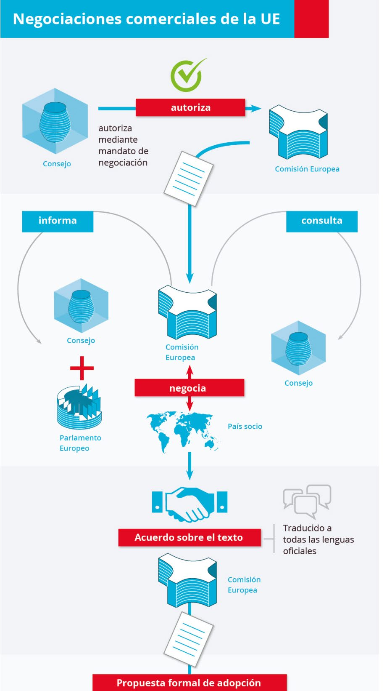
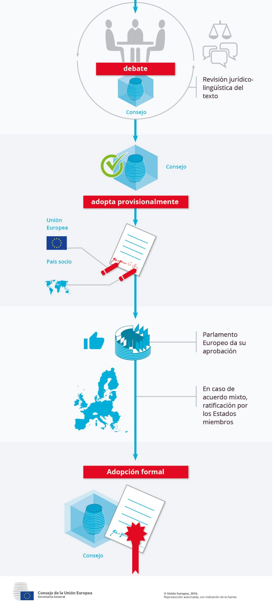

# Tema 6: Las políticas Comercial y de Cooperación al Desarrollo

## 1. La política comercial autónoma

### 1.1. Política comercial: visión general

El objetivo del `Tratado de Roma` era crear una [Unión Aduanera](tema-1.md) en la que los intercambios estarían libres de obstáculos y se aplicaría un arancel exterior común a las importaciones de terceros países.

Paulatinamente, la **expansión del comercio internacional** convertiría a la política comercial exterior común en una de las más importantes de la Comunidad, dada su **contribución al crecimiento económico**.

Con la entrada en vigor del `Tratado de Lisboa` (2009), la **política comercial exterior de la UE** ha pasado a ser uno de los **pilares de las relaciones exteriores de la Unión**. Regula las relaciones comerciales de los Estados miembros con terceros países. Además, aquél trajo consigo las siguientes implicaciones:

- Nuevas competencias exclusivas
- **La regla general para la adopción de decisiones por el Consejo pasó a ser la mayoría cualificada**. La unanimidad se aplicará de forma excepcional.
- Inversiones directas extranjeras: al pasar a ser comunitaria la competencia en inversión extranjera directa, la Comisión tiene la obligación de negociar también su protección.
- **Nuevo papel del Parlamento Europeo a la hora de establecer el marco de aplicación de la política comercial y en las negociaciones internacionales**. Este procedimiento coloca al Parlamento Europeo en pie de igualdad con el Consejo, que representa a los Estados miembros, para la mayor parte de la legislación de la UE.
- Comitología derivada del `Tratado de Lisboa`. El `Tratado de Lisboa` establece nuevos procedimientos para la adopción de medidas de ejecución. Desaparece la figura del Consejo en la toma de decisiones vía Comitología.

*[Comitología]: Procedimientos de delegación en la Comisión

==**Objetivo de la política comercial: garantizar el desarrollo armónico del comercio mundial y promover su carácter equitativo y sostenible.**==

En 2018 el Consejo adoptó un nuevo planteamiento para la negociación y celebración de acuerdos comerciales de la UE:

El análisis de la Política Comercial Exterior suele separarse en dos grandes bloques:

- [**Política comercial autónoma**](#12-la-política-comercial-autónoma): hace referencia a las medidas establecidas por la propia UE con carácter unilateral, respetando las obligaciones multilaterales que se derivan de sus compromisos ante la Organización Mundial del Comercio (OMC).
- [**Política comercial convencional**](#2-la-política-comercial-convencional-y-las-relaciones-de-cooperación): se basa en los acuerdos suscritos por la UE con distintos países o grupos de países (*la mayoría de ellos en vías de desarrollo*). Dichos acuerdos han de ser compatibles con las reglas de la OMC y adaptarse como excepciones específicas al **principio de la nación más favorecida**.

==Ambos grupos de políticas se refieren únicamente al comercio de la UE con el resto del mundo. **El comercio entre Estados miembros no forma parte de la política comercial**.==

### 1.2. La política comercial autónoma

#### 1.2.1. El arancel aduanero común

Consiste en aplicar derechos de aduana uniformes a los productos importados de terceros países, independientemente de cual sea el Estado miembro de destino.

Las importaciones procedentes de otro Estado miembro disfrutan por definición de un régimen más favorable que las procedentes de un tercer Estado.

Los aranceles no son uniformes para todos los productos y han sido reducidos en múltiples ocasiones a lo largo del tiempo.

#### 1.2.2. El régimen general de importación

Está libre de restricciones cuantitativas, pudiéndose recurrir a medidas de salvaguardia cuando se considere oportuno.

Excepciones: algunos productos agrícolas y textiles.

### 1.2.3. El régimen general de exportaciones

Tiene carácter liberalizado, aunque contempla:

1. Medidas de salvaguarda (*ej: por escasez de productos esenciales*)
2. Restricciones o prohibiciones a la exportación, por razones de moralidad pública, orden público, seguridad pública, salud y medio ambiente, etc.

### 1.2.4. Las medidas de defensa comercial

Son medidas reconocidas por los Reglamentos de la OMC como legítimos instrumentos potenciales de protección comercial. Como cualquier miembro de la OMC, la UE puede adoptar:

- **Medidas antidumping**
- **Medidas antisubvención**, para impedir la importación de productos mantenidos a bajo precio con subvenciones públicas en el tercer país de origen.

Asimismo, la UE puede adoptar medidas de salvaguarda limitando los flujos de los productos importados.

### 1.2.5. El sistema de preferencias generalizadas (SPG)

la UE proporciona un acceso preferencial no recíproco al mercado comunitario de productos originarios en países y territorios en desarrollo a través de la exoneración total o parcial de los derechos arancelarios, con el fin de reducir la pobreza en los países en vías de desarrollo, garantizar los derechos humanos y laborales fundamentales y promover el desarrollo sostenible y la gobernanza.

Es simultáneamente un **instrumento de la política comercial** y de la **política de desarrollo** de la Unión Europea.

Comprende 3 regímenes preferenciales aplicables:

1. General: concede exención total de derechos para los productos no sensibles
2. Régimen especial de estímulo del desarrollo sostenible y la gobernanza (`SPG+`): eliminación de aranceles para todos los productos a países considerados como vulnerables que apliquen los convenios internacionales sobre derechos humanos y medio ambiente.
3. Régimen especial a favor de los países menos desarrollados (`Iniciativa EBA: Todo menos armas`): exención total de aranceles a todos los productos originarios de los países menos desarrollados, con excepción de las armas.

## 2. La política comercial convencional y las relaciones de cooperación

Tipos principales de acuerdos:

1. **Uniones Aduaneras**: eliminan los derechos de aduana en el comercio bilateral y establecen un arancel aduanero común para los importadores extranjeros.
2. **Acuerdos de asociación, estabilización, de libre comercio profundos e integrales y de asociación económica**: eliminan o reducen los aranceles aduaneros en el comercio bilateral.
3. **Acuerdos de asociación y cooperación**: dejan inalterados los aranceles aduaneros. Proporcionan un marco general para las relaciones económicas bilaterales.

En 2015, la Comisión puso en marcha una nueva **estrategia de comercio e inversión de la UE (*Comercio para todos: hacia una política de comercio e inversión más responsable*)** para tratar de responder al intenso debate que estaba teniendo lugar en torno al comercio de la UE.

En 2021 la Comisión presentó su *revisión de la política comercial*, titulada ***Una política comercial abierta, sostenible y activa***. Es la sucesora de la estrategia ***Comercio para todos*** de 2015. Fija el rumbo de la política comercial hasta 2030. Su objetivo es que la política comercial responda a los retos actuales y facilite las transiciones ecológica y digital a través de una ***autonomía estratégica abierta***.

Abarca:

- **Resiliencia y competitividad** para reforzar la economía de la UE
- **Sostenibilidad y equidad**, lo que refleja la necesidad de que la actuación de la Unión sea responsable y justa
- **Firmeza y cooperación** basada en normas para mostrar que la UE se inclina por la cooperación internacional y el diálogo, pero también está dispuesta a combatir las prácticas desleales y utilizar herramientas autónomas para defender sus intereses siempre que sea necesario.

## 3. La OMC y la política comercial exterior de la Unión Europea

El sistema mundial de comercio nació en 1948, con el **`Acuerdo General sobre Aranceles Aduaneros y Comercio (GATT)`**. Su objetivo era promover la reconstrucción y el crecimiento económicos a través de la apertura de mercados y el libre comercio.

Mediante el Acuerdo de Marrakech se crea la **`OMC (Organización Mundial de Comercio)`**

??? note "Objetivos de la OMC"
    - Apertura del comercio en beneficio de todos
    - Reducir tensiones comerciales y resolver diferencias
    - Aumentar los niveles de vida
    - Lograr el pleno empleo y un nivel creciente de la renta real y de la demanda efectiva
    - Incrementar la producción y el comercio de mercancías y servicios
    - Fomentar la buena gobernanza
    - Alcanzar el desarrollo sostenible, incluida la protección del medio ambiente y la salud
    - Tener en cuenta las necesidades de los países en desarrollo

??? note "Funciones de la OMC"
    - Facilitar la aplicación, administración y funcionamiento de los distintos acuerdos comerciales
    - Constituir un foro para las negociaciones comerciales multilaterales
    - Resolver las diferencias comerciales, por medio del Órgano de Solución de Diferencias
    - Supervisar las políticas comerciales nacionales de sus miembros
    - Prestar asistencia técnica y formación a los países en vías de desarrollo
    - Cooperar con otras organizaciones internacionales para garantizar una coherencia en la elaboración de políticas económicas a escala mundial

Tras su estancamiento en cuestiones fundamentales (sobre todo en lo relacionado con el acceso al mercado), la Unión se vio obligada a buscar vías alternativas para garantizar un mejor acceso a los mercados de terceros países. Con este fin se introdujo una nueva generación de acuerdos de libre comercio (ALC), de alcance amplio, que van más allá de las reducciones arancelarias y del comercio de bienes.

- Los **acuerdos comerciales modernos de la UE** contienen normas sobre comercio y desarrollo sostenible con estándares sociales y medioambientales.
- La **asociación concluida con Japón** (2018) contiene una referencia explícita a la ratificación y aplicación real del Acuerdo de París sobre cambio climático.
- La Comisión también ha comenzado a llevar a efecto nuevas normas que promueven la **extracción responsable de minerales**. Dichas normas tienen por fin evitar la importación de productos que se hayan extraído mediante el trabajo forzoso.

??? note "Tendencias en el comercio internacional actual según el Instituto Alemán de Cooperación e Innovación"
    1. Se agudiza la crisis dentro de la propia WTO, la Organización Mundial del Comercio, en detrimento de la igualdad de oportunidades de hacer negocios internacionales entre países.
    2. Comercio cada vez más dominado por las pautas de consumo y las preferencias de los consumidores.
    3. Nuevos nichos de oportunidad comercial de exportación de servicios. Las tendencias que promueven las exportaciones, sobre todo de los servicios, son 4:
        1. las tecnologías digitales y la IA
        2. los cambios demográficos
        3. El aumento de los ingresos en los países emergentes
        4. El cambio climático.
    4. Mayor grado de tensión comercial debido a las guerras comerciales promovidas por EEUU y China. Obliga a una revisión y reorientación de los planes estratégicos conforme a las tendencias de los acuerdos comerciales bilaterales de la UE con el resto del mundo. Las empresas deben pensar en mercados alternativos para soportar el impacto de los sobrecostes y las restricciones al comercio.
    5. Nuevo impulso de la digitalización, las tecnologías y el comercio electrónico mundial.

## 4. La política de cooperación internacional y desarrollo (CPD)

La CPD se reforzó con el `Tratado de Lisboa` (2009) y se reiteró con el `Nuevo Consenso Europeo sobre Desarrollo` (2017). En la `Agenda 2030` el `Consenso Europeo sobre Desarrollo` reafirmó el compromiso de la UE con la CPD y la reconoció como un elemento crucial para alcanzar los `Objetivos de Desarrollo Sostenible (ODS)`.

*[CPD]: Cooperación Internacional y Desarrollo

!!! tip "Objetivos globales"
    - Reducir la pobreza en el mundo
    - Garantizar un desarrollo económico, social y medioambiental sostenible
    - Promover la democracia, la paz y la seguridad

- ==**Su principal objetivo es erradicar la pobreza de manera sostenible en el contexto de la Agenda 2030 para el Desarrollo Sostenible**==.
- Introdujo en su núcleo central los denominados **Objetivos de Desarrollo Sostenible u Objetivos Mundiales**.
- El **Tratado de Lisboa** establece como objetivo primario de la política de desarrollo de la UE la reducción y, finalmente, la erradicación de la pobreza.
- El `Nuevo Consenso Europeo sobre Desarrollo` (2017, piedra angular de la política de desarrollo de la UE) enmarca la aplicación de la `Agenda 2030` en una asociación con todos los países en desarrollo y tiene en cuenta el `Tratado de Lisboa`.
- Los **cinco temas clave** que sustentan el trabajo de la Unión Europea **en materia de desarrollo sostenible** son conocidos como las *5P*: **Personas, Planeta, Prosperidad, Paz, Alianzas**.

!!! success ""
    Los objetivos de desarrollo sostenible forman parte de la Agenda 2030 para el Desarrollo Sostenible (aprobada por las Naciones Unidas en 2015)

!!! bug "Plan Europeo de Inversiones Exteriores (PEIE)"
    - Apoya el desarrollo sostenible y determina, prepara y presta apoyo a proyectos de inversión en países no europeos
    - Impulsa la inversión y la creación de empleo en África y los países vecinos de la UE.
    - Prioridades: movilización de la inversión, intensificación de la asistencia técnica y apoyo de las reformas económicas y estructurales para mejorar el entorno empresarial y el marco político general.
    - En 2017 se creó el **`Fondo Europeo de Desarrollo Sostenible (FEDS)`**, la **`Garantía del FEDS`** y el **`Fondo de Garantía del FEDS`** para cumplir las prioridades.
    - Integrado por 3 pilares:
        - `FEDS (Fondo Europeo para el Desarrollo Sostenible)`: proporciona un dispositivo financiero integrado para financiar las inversiones en las regiones de África y en los países de la vecindad europea
        - **Asistencia técnica** a las autoridades locales para que desarrollen proyectos mejores y viables.
        - Asistencia técnica actividades que apoyan el diálogo estructurado del sector político y privado con los países socios y otras partes interesadas para **mejorar el clima de inversión y el entorno empresarial**.

### 4.1. Instrumentos

La ayuda al desarrollo puede suministrarse de múltiples formas:

- **Proyectos**: serie de actividades con objetivos específicos y periodo y presupuesto definidos.
- **Subvenciones**: contribuciones financieras directas a organizaciones o a los proyectos que gestionan. Se conceden por convocatorias.
- **Contratos**: se adjudican mediante procedimientos de licitación de servicios, suministros u obras.
- **Apoyo presupuestario**: transferencias a la hacienda nacional del país socio. Va acompañado de un intenso diálogo político. Financia la estrategia de desarrollo del país socio. **Está condicionado a resultados** (sólo se desembolsa cuando se cumplen las condiciones acordadas para los resultados).
- **Financiación combinada** (aka instrumentos financieros innovadores, *blending facilities*): complementa a otras modalidades de ayuda y está pensada de cara a las prioridades regionales, nacionales y transversales. **El principio del mecanismo es combinar las subvenciones de la UE con préstamos o activos procedentes de entidades públicas y privadas**.

    La cobertura geográfica de los mecanismos regionales de financiación combinada se ha ido ampliando gradualmente. Abarcan las siete regiones de la cooperación exterior de la UE

### 4.2. Fuentes financieras de la política de cooperación al desarrollo

La ayuda procede de 2 fuentes financieras:

1. El Presupuesto comunitario
2. El BEI: Concede préstamos en el contexto del componente externo de sus actividades

*[BEI]: Banco Europeo de Inversiones

#### 4.2.1. El instrumento de vecindad, cooperación al desarrollo y cooperación internacional (IVCDCI-EUROPA GLOBAL)

Se aplica desde 2021. Cuenta con una asignación global de **79.500 millones de euros** a precios corrientes **para el periodo 2021-2027**.

Ha fusionado la mayoría de los múltiples instrumentos de cooperación exterior que existían en el ciclo financiero anterior.

Está organizado en torno a **tres pilares principales**: programas geográficos (el más importante); programas temáticos; y acciones de respuesta rápida.

!!! question "Fondo Europeo de Desarrollo Sostenible Plus (FEDS+)"
    Es una de las novedades incluidas en `Europa Global`.

    El FEDS+ constituirá un dispositivo financiero integrado que aporte capacidad financiera en forma de subvenciones, asistencia técnica, instrumentos financieros, garantías presupuestarias y operaciones de financiación mixta en todo el mundo. A diferencia de su predecesor su **alcance es mundial**.

#### 4.2.2. Instrumento de Apoyo a la Preadhesión (IPA III)

Cuenta con una asignación global de **14.162 millones de euros** a precios corrientes **para el periodo 2021-2027**.

Rige la financiación europea concedida para aquellos países que se encuentran en el camino hacia la adhesión a la Unión Europea. Además, contribuirá a los objetivos de protección del medio ambiente y clima, igualdad de género y derechos humanos.

Financiará inversiones en sectores clave como la conectividad, infraestructuras, medio ambiente,energía y transformación digital, para impulsar la convergencia con la UE.
